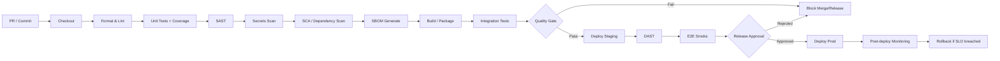
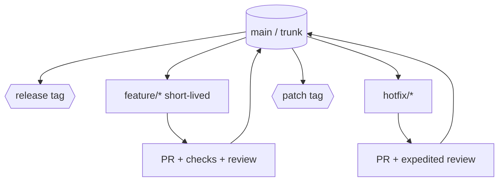

# Sıfırdan Program Yazmak İçin Küresel Kodlama Standartları, Kontroller, Doğrulamalar ve Checkpoint Seti

## Yönetici özeti

Bu rapor, proje türü **belirtilmediği** için (web, mobil, masaüstü, gömülü, SaaS, kütüphane vb.) “genel amaçlı” ve **kurumlarca uyarlanabilir** bir standart seti sunar. Bu set; yazılım yaşam döngüsü, kalite, güvenlik ve süreç yönetişimini tek bir **uygulanabilir** çerçevede birleştirir. citeturn13view0turn29search6

Çekirdek yaklaşım, güvenli yazılım geliştirme uygulamalarını SDLC’ye eklemeyi öneren **NIST SSDF** (SP 800-218) mantığına dayanır: güvenlik gereksinimleri ve uygulamaları yaşam döngüsüne entegre edilir; hedef, sürümlerdeki zafiyet sayısını azaltmak ve zafiyetlerin etkisini düşürmektir. citeturn13view0turn14view0

Uygulama güvenliği tarafında, **OWASP Top 10:2025** “farkındalık ve önceliklendirme” için küresel referans; ancak OWASP’nin kendi açıklamasına göre Top 10’un doğası gereği bazı riskleri araçlarla “tam kapsamak” mümkün değildir ve “doğrulanabilir standart” olarak **ASVS**’nin tercih edilmesi önerilir. citeturn12view1turn29search6turn12view2

Kalite kapıları (quality gates) ve metrikler “eski kodu mükemmelleştirmeden önce yeni kodu temiz tutma” yaklaşımıyla uygulanmalıdır (“Clean as You Code”). Örneğin, yeni kodda test kapsamı ve tekrar oranı gibi eşikler için endüstride sık kullanılan varsayılan eşikler vardır (örn. yeni kod coverage ≥ %80, yeni kod duplication ≤ %3). citeturn25view2

Kod kapsamı için “tek bir ideal sayı yoktur”; iş kritiklik düzeyi, değişim sıklığı ve risk profiline göre hedefler seçilmelidir. Google’ın kamuya açık önerileri (örn. %60 kabul edilebilir, %75 takdire değer, %90 örnek) bir kalibrasyon başlangıcıdır; ancak kurum içi hedef yine risk-temelli seçilmelidir. citeturn25view1turn25view2

Bu rapor, aşağıdaki çıktıları sağlar: (i) resmi standartlar tablosu, (ii) dil-bağımsız kodlama kuralları checklist’i, (iii) OWASP Top 10:2025’e hizalı güvenlik kontrolleri ve örnek doğrulamalar, (iv) code review/CI/CD/release kapıları, (v) metrik hedefleri ve araç haritası, (vi) yönetişim ve süreç şablonları (indirilebilir paket). citeturn25view2turn18search0turn13view0

## Referans alınacak standartlar ve otoriteler

Aşağıdaki tablo, **evrensel olarak “her yerde zorunlu”** olan standartlardan ziyade, küresel ölçekte en sık referans verilen ve “kurum standardı” üretmek için temel oluşturan kaynakları listeler. Bazı **ISO/IEEE** standartları ücretli olabilir; yine de resmî standart sayfaları belirli bir özet ve kimlik bilgisi sağlar. citeturn3search0turn4search0

**Kurum/otorite isimleri (ilk geçişte):** entity["organization","International Organization for Standardization","standards body"] (ISO), entity["organization","IEEE Standards Association","standards org"] (IEEE), entity["organization","Open Worldwide Application Security Project","appsec nonprofit"] (OWASP), entity["organization","National Institute of Standards and Technology","us standards agency"] (NIST), entity["organization","Software Engineering Institute","cmu research institute"] ve entity["organization","Carnegie Mellon University","pittsburgh university"] (SEI/CERT). citeturn5search1turn13view0turn12view1

### Standartlar, kılavuzlar ve “resmî referans” listesi

| Aile | Referans (standart / kılavuz) | Tek cümlede amacı (ne işe yarar) | Ne zaman “minimum referans” olmalı? | Resmî kaynak |
|---|---|---|---|---|
| ISO/IEC/IEEE | ISO/IEC/IEEE 12207:2017 | Yazılım yaşam döngüsü süreçleri için süreç/aktivite çerçevesi sağlar. citeturn3search0 | Sıfırdan proje yönetimi ve süreç tanımı yaparken | citeturn3search0 |
| ISO/IEC/IEEE | ISO/IEC/IEEE 15288:2015 (ve güncel revizyonlar) | Sistem yaşam döngüsü süreçleri için ortak süreç çerçevesi sağlar. citeturn22search0 | Yazılım + altyapı + operasyon birlikte ele alınacaksa | citeturn22search0 |
| ISO/IEC/IEEE | ISO/IEC/IEEE 29148:2018 | Sistem/yazılım gereksinim mühendisliği süreçleri ve çıktılarını tanımlar. citeturn10search4 | Gereksinim standardı ve dokümantasyon seti oluştururken | citeturn10search4 |
| ISO/IEC/IEEE | ISO/IEC/IEEE 15289:2019 | Yaşam döngüsü boyunca üretilecek doküman/“information item” içeriklerini tanımlar. citeturn10search8 | Dokümantasyon standardı ve “Definition of Done” yazarken | citeturn10search8 |
| ISO/IEC/IEEE | ISO/IEC/IEEE 42010:2022 | Mimari tanım (architecture description) için gereksinim ve yapı çerçevesi sağlar. citeturn10search12 | Mimari dokümantasyon/ADR tasarlarken | citeturn10search12 |
| ISO/IEC | ISO/IEC 25010:2023 | Ürün kalite modelini (kalite karakteristikleri) tanımlar. citeturn3search10 | Kalite gereksinimleri (performans, güvenilirlik vb.) tanımlarken | citeturn3search10 |
| ISO/IEC | ISO/IEC 25023:2016 | ISO 25010 kalite karakteristiklerini ölçmek için kalite ölçümlerini tanımlar. citeturn26search0 | Kalite metrikleri ve kabul kriterlerini resmi temele bağlarken | citeturn26search0 |
| ISO/IEC/IEEE | ISO/IEC/IEEE 29119 serisi (örn. 29119-1:2022, 29119-2:2021) | Yazılım test kavramları, test süreçleri ve test tasarım teknikleri için standart setidir. citeturn3search6turn3search12turn3search15 | Test stratejisi, süreçleri ve artefaktlarını standardize ederken | citeturn3search6 |
| ISO/IEC | ISO/IEC 27001:2022 | Bilgi güvenliği yönetim sistemi (ISMS) gereksinimlerini tanımlar. citeturn3search2 | Kurumsal güvenlik yönetişimi ve denetlenebilirlik hedefleniyorsa | citeturn3search2 |
| ISO/IEC | ISO/IEC 27002:2022 | ISMS için kontrol hedefleri ve iyi uygulama kontrolleri sağlar. citeturn5search2 | Teknik/organizasyonel güvenlik kontrolleri kataloğu isterken | citeturn5search2 |
| ISO/IEC | ISO/IEC 27034 (örn. 27034-1:2011) | Uygulama güvenliğini uygulama yönetim süreçlerine entegre etmeyi hedefler. citeturn5search3turn26search3 | AppSec’i SDLC’ye süreçsel olarak gömmek istiyorsanız | citeturn5search3 |
| ISO/IEC | ISO/IEC 29147:2018 | Zafiyet bildirim/ifşa (vulnerability disclosure) süreçlerine rehberlik eder. citeturn9search1 | Güvenlik bildirim kanalı, danışma/advisory ve koordinasyon süreci kurarken | citeturn9search1 |
| ISO/IEC | ISO/IEC 30111:2019 | Üründe bildirilen zafiyetlerin işlenmesi ve giderilmesi süreçlerini tanımlar. citeturn9search4 | “Vulnerability handling” ve fix SLA’larını standardize ederken | citeturn9search4 |
| ISO/IEC | ISO/IEC TR 24772-1:2019 | Programlama dili kaynaklı zafiyet türlerini listeler ve kaçınılması gerekenleri tanımlar. citeturn9search2 | Dil-bağımsız güvenli kodlama risk kataloğu isterken | citeturn9search2 |
| ISO/IEC | ISO/IEC TS 17961:2013 | C dili için güvenli kodlama kurallarını tanımlar (stil değil, güvenlik kural seti). citeturn9search3 | C/C++ kritik yazılım (embedded vb.) geliştiriyorsanız | citeturn9search3 |
| ISO/IEC | ISO/IEC 5230:2020 (OpenChain) | Açık kaynak lisans uyum programı için gereksinimleri tanımlar. citeturn26search1 | OSS kullanıyorsanız ve tedarik zinciri/uyum hedefliyorsanız | citeturn26search1 |
| ISO/IEC | ISO/IEC 5962:2021 (SPDX) | Yazılım bileşen ve meta verilerini standart formatta ifade etmeyi sağlar (SBOM temeli). citeturn26search2 | SBOM ve tedarik zinciri şeffaflığı hedefliyorsanız | citeturn26search2 |
| IEEE | IEEE 1012-2024 | Sistem/yazılım/doğrulama-geçerleme (V&V) süreç gereksinimlerini tanımlar. citeturn4search0 | Kritik sistemlerde V&V planı/kanıt yükümlülüğü varsa | citeturn4search0 |
| IEEE | IEEE 1028-2008 | Yazılım review/inspection/audit türlerini ve yürütme prosedürlerini tanımlar. citeturn4search1 | Resmî inceleme/audit mekanizması tasarlarken | citeturn4search1 |
| IEEE | IEEE 730 (SQA süreçleri) | Yazılım kalite güvence süreçlerini başlatma/planlama/yürütme gereksinimlerini tanımlar. citeturn4search2 | SQA planı ve kalite yönetim süreçleri yazarken | citeturn4search2 |
| NIST | NIST SP 800-218 (SSDF) | SDLC’ye entegre edilebilir üst seviye güvenli geliştirme pratikleri seti sağlar. citeturn13view0 | “Secure SDLC standardı”nın çekirdeği olarak | citeturn13view0 |
| NIST | NIST SP 800-53 Rev.5 | Güvenlik ve mahremiyet kontrolleri kataloğudur (kurumsal kontrol havuzu). citeturn1search0 | Kontrol kütüphanesi (policy→kontrol→kanıt) kurarken | citeturn1search0 |
| NIST | NIST SP 800-63-4 | Dijital kimlik, kimlik doğrulama ve federasyon için teknik gereksinimler sunar. citeturn1search5 | AuthN tasarımı, MFA, kimlik seviyesi hedefleri için | citeturn1search5 |
| NIST | NIST SP 800-57 (Key Management) | Kripto anahtar yönetimi için genel rehber ve en iyi uygulamalar sağlar. citeturn21search3 | Şifreleme/anahtar yaşam döngüsü standardı yazarken | citeturn21search3 |
| NIST | FIPS 140-3 / CMVP | Doğrulanmış kripto modül kullanımı için program ve standart çerçevesi sağlar. citeturn1search2turn1search10 | Regüle sektör/uyum gerektiren kripto kullanımında | citeturn1search2 |
| NIST | NIST SSDF (SP 800-204C DevSecOps) | Bulut-native/DevSecOps boru hatları için uygulama rehberi sağlar. citeturn21search2 | CI/CD tasarımını güvenlikle birleştirirken | citeturn21search2 |
| NIST | NIST NVD | CVE/CPE gibi standartlara dayalı zafiyet verisi deposudur. citeturn2search1turn2search5 | Bağımlılık taraması (SCA) ve zafiyet triage için | citeturn2search1 |
| OWASP | OWASP Top 10:2025 | Web uygulama risklerinde en kritik 10 kategoriyi listeler (farkındalık/öncelik). citeturn12view2turn29search5 | Secure coding kültüründe “minimum” başlangıç noktası olarak | citeturn12view2 |
| OWASP | OWASP ASVS (v5.0.0 stable) | Uygulama güvenlik kontrolleri için doğrulanabilir gereksinimler ve test baz sağlar. citeturn23view0turn29search6 | Güvenlik gereksinimleri ve test kriterlerini standardize etmek için | citeturn23view0 |
| OWASP | OWASP Cheat Sheet Series | Konu bazlı (input validation, auth, logging vb.) uygulanabilir güvenlik rehberleri sunar. citeturn2search6 | Kod standardına “somut kontrol” eklerken | citeturn2search6 |
| OWASP | CycloneDX (ECMA-424) | SBOM/BOM format standardı; tedarik zinciri risk azaltma hedefler. citeturn8search12turn8search5 | SBOM üretimi ve paylaşımı için | citeturn8search12 |
| CERT | SEI CERT Coding Standards Wiki | C/C++/Java vb. diller için güvenli kodlama standartlarını yaşayan bir rehber olarak sunar. citeturn5search1 | Dil-özel güvenli kodlama kuralları üretirken | citeturn5search1 |

**SBOM minimum içerik notu:** SBOM için NTIA minimum öğeler raporu ve bunun üzerine inşa edilen güncellemeler (örn. CISA “Minimum Elements” güncellemeleri) tedarik zinciri şeffaflığı için pratik taban sunar. citeturn8search3turn8search7

## Dil-bağımsız kodlama prensipleri ve uygulanabilir kurallar

Bu bölüm “kod stili”nden çok, **tutarlılık + test edilebilirlik + bakım kolaylığı + güvenli varsayılanlar** hedefini ölçülebilir hale getirir. Karmaşıklık ve bakım kolaylığı gibi metriklerin, modern yazılımlarda riskleri görünür kıldığı ve daha fazla test/yeniden çalışma gerektiren bölgeleri işaretlediği; Microsoft’un code metrics dokümantasyonunda da vurgulanır. citeturn25view0

### Kurumsal “Kod Standardı” için çekirdek kural seti

Aşağıdaki kontrol setini, repo kökünde `CODING_STANDARD.md` içinde “zorunlu” olarak yayınlayıp CI’da gate’e bağlamak pratik bir başlangıçtır. (İndirilebilir şablon paketi rapor sonunda verilmiştir.) citeturn25view2turn18search0

| Alan | Kural (dil-bağımsız) | Somut checkpoint (PR/CI’da doğrulama) | Kaynak dayanağı |
|---|---|---|---|
| Tasarım | Küçük, tek sorumluluklu bileşenler; değişiklik etkisini minimize et | Fonksiyon başına karmaşıklık eşiği; high nesting uyarısı; büyük PR uyarısı | Cyclomatic complexity’nin test/bakım zorluğuna işaret etmesi citeturn15search2turn25view0 |
| Tekrar | DRY: tekrar eden bilgi/iş mantığı azaltılır | “Duplication on new code” eşiği (örn. ≤ %3) | “Clean as You Code” gate örnekleri citeturn25view2 |
| Okunabilirlik | İsimlendirme anlamlı ve tutarlı; boolean’lar `is/has/can` | PR checklist: isimlendirme/okunabilirlik maddeleri zorunlu | Google code review’da tasarım/okunabilirlik vurgusu citeturn6search16turn6search0 |
| Hata yönetimi | Hatalar sınıflandırılır; “fail closed” | Global error handler; güvenli hata mesajları; rollback/transaction politikası | OWASP Top 10:2025 A10 “fail open / improper error handling” odağı citeturn29search3 |
| Logging | Yapılandırılmış log + korelasyon ID + güvenlik olay logları | “Security logging” checklist; log injection’a karşı encoding | OWASP Logging ve A09 önerileri citeturn21search1turn28search3 |
| Yorum/Doküman | Kod “neden”i açıklar; kararlar ADR ile kaydedilir | Büyük mimari karar için ADR zorunlu; public API docstring | ISO dokümantasyon bilgi öğeleri yaklaşımı citeturn10search8turn10search12 |
| Test edilebilirlik | Birimler deterministik; bağımlılıklar izole; test piramidi | Unit/integration/e2e ayrımı; flaky test “merge blocker” | Test piramidi prensibi citeturn6search5 |
| Kod inceleme | Kod sağlığı zamanla iyileşmeli; inceleme tasarım/okunabilirlik/güvenlik kapsamalı | PR template + reviewer checklist; en az 1–2 onay | Google code review standardı citeturn6search0turn6search16 |

### Minimum “formatting, comments, logging” standardı

Aşağıdaki maddeler, pratikte en çok kalite farkı yaratan “temel hijyen” kurallarıdır:

- **Formatting:** Tek formatter; CI’da `format-check` zorunlu (formatı geliştirme ortamından bağımsız hale getirir). citeturn25view2  
- **Comments:** Yorumlar “neden”e odaklanır; kodun ne yaptığı mümkünse koddaki isimlerden anlaşılır (ADR ile kritik kararlar kayıt altına alınır). citeturn10search8turn10search12  
- **Logging:** Güvenlik loglaması ayrı sözlük/terminolojiyle standardize edilir; logging mekanizması özellikle güvenlik olayları için tasarlanır. citeturn21search1turn21search5turn28search3

## Güvenlik doğrulamaları ve kontrol örnekleri

Bu bölüm, “ne yapılmalı”yı **kontrol** ve **örnek doğrulama** seviyesine indirir. Çerçeve olarak: (i) OWASP Top 10:2025 risk kategorileri, (ii) ASVS’nin doğrulanabilir gereksinim yaklaşımı, (iii) NIST SSDF’nin SDLC’ye entegre pratikleri birlikte kullanılır. citeturn12view2turn23view0turn13view0

### Güvenlik kontrolleri: kontrol → örnek check → otomasyon

| Kontrol alanı | Kontrol (security rule) | Örnek doğrulama/check (CI / test / runtime) | Resmî referans |
|---|---|---|---|
| Input validation | Sunucu tarafında allow-list doğrulama (tip/format/uzunluk) | Unit test: validator edge-case set; fuzz test; DAST param manipülasyonu | OWASP Input Validation citeturn11search0turn11search9 |
| Injection | Komut/sorgu ile veriyi ayrıştır: güvenli API/parametreli sorgu | SAST: injection pattern; unit test: tainted input; code review: string concat query | OWASP Injection Prevention + OWASP A05 citeturn27search2turn27search15 |
| SSRF | URL allow-list + egress kontrol + internal metadata bloklama | Security test: internal IP/localhost denemeleri; network policy; SAST URL fetch kontrolü | OWASP SSRF Prevention citeturn27search3 |
| AuthN | Parola saklama: modern hash; MFA/step-up | Test: login brute force; MFA zorunluluğu; password policy testleri | OWASP Password Storage + MFA + OWASP A07 citeturn11search1turn27search21turn29search2 |
| Session | Token rotasyonu, süre aşımı, güvenli cookie flag’leri | DAST: cookie flags; integration test: logout invalidation | OWASP Session Management citeturn11search2 |
| AuthZ | “Deny by default”, object-level authorization (IDOR engeli) | Entegrasyon test: farklı kullanıcıyla farklı kaynak erişimi; policy unit tests | OWASP Authorization + OWASP A01 citeturn27search0turn28search0 |
| Kriptografi | At-rest/in-transit encryption; deprecated algoritma yok | Config test: TLS only; crypto lint; key rotation prosedürü | OWASP Cryptographic Storage + NIST key mgmt + OWASP A04 citeturn11search3turn21search3turn30search1 |
| Secrets | Secret’lar merkezi yönetilir; repo’da secret yok | Secrets scan (pre-commit+CI); key rotation drill | OWASP Secrets Management citeturn21search0 |
| Bağımlılıklar | SCA + CVE triage + SBOM | Dependency scan fail on critical/high; SBOM artifact üretimi | OWASP Dependency-Check + NVD + SBOM refs citeturn24search0turn2search1turn8search3 |
| Supply chain | İmzalı artefact, trusted repo, CI/CD tooling güncel | Artifact signature verify; internal “known-good” repo; CI toolchain patch policy | OWASP A03 ve A08 önlemleri citeturn28search2turn30search0 |
| Güvenlik logları | Olay kaydı + alerting + audit trail integrity | SIEM korelasyon; append-only audit trail; log injection koruması | OWASP Logging + OWASP A09 citeturn21search1turn28search3 |
| Zafiyet yönetimi | Disclosure + handling süreci, SLA ve kanıt | Security@ kanalı; triage SLA; advisory/patch yayın akışı | ISO 29147 + ISO 30111 citeturn9search1turn9search4 |

### OWASP Top 10:2025 için mitigasyon checklist’i ve pratik kontroller

OWASP Top 10:2025 listesi aşağıdaki 10 kategoriden oluşur. citeturn12view2turn29search5

Aşağıdaki tablo, her kategori için “en az” yapılması gerekenleri CI/PR kontrolüne dönüştürür (örnek check’ler). OWASP’nin kendi notu: bazı riskler (özellikle “Insecure Design”) test ve araçlarla tam kapsanamaz; bu yüzden Top 10’u, ASVS gibi doğrulanabilir bir standardın üstünde, “risk kataloğu” olarak kullanmak daha doğru olur. citeturn29search6

| OWASP Top 10:2025 kategori | Minimum mitigasyonlar (kontrol diliyle) | Örnek otomatik check |
|---|---|---|
| A01 Broken Access Control | Default deny; merkezi yetkilendirme; record ownership enforcement | Integration test: IDOR; policy tests; endpoint authz matrix | citeturn28search0 |
| A02 Security Misconfiguration | Hardened baseline; gereksiz servis/feature kapalı; default credential yok | IaC/config scan; container CIS baseline kontrolü; “secrets in config” taraması | citeturn28search1 |
| A03 Software Supply Chain Failures | Unmaintained dependency izleme; tooling güncel; SBOM | SCA + SBOM + signature verify; dependency freshness policy | citeturn28search2turn8search3 |
| A04 Cryptographic Failures | Deprecated algoritma yok; key management; at-rest encryption | Crypto lint; TLS config test; key rotation kanıtı | citeturn30search1turn21search3 |
| A05 Injection | Veriyi komuttan ayır; safe API; parametrize | SAST injection rules; unit tests for query builder | citeturn27search15turn27search2 |
| A06 Insecure Design | Threat modeling; secure patterns; SDLC’ye security dahil | PR gate: threat model/ADR zorunlu (kritik modüller); design review | citeturn30search2turn14view2 |
| A07 Authentication Failures | MFA; password manager-friendly; default credential yok | Auth test suite; session invalidation; weak password checks | citeturn29search2turn27search21 |
| A08 Software/Data Integrity Failures | Dijital imza/kapı; trusted repo; integrity verify | Artifact signing; checksum verify; trusted artifact repository | citeturn30search0 |
| A09 Security Logging & Alerting Failures | Güvenlik olay logları; audit trail integrity; fail closed | SIEM alert rule tests; append-only logs; rollback-on-error policy | citeturn28search3turn21search1 |
| A10 Mishandling of Exceptional Conditions | Exception’ları düzgün ele al; fail securely; input validation boşluk bırakma | Chaos/fault injection test; negative test seti; “fail-open” statik kural | citeturn29search3 |

## Kalite kontrolleri, checkpoint’ler ve CI/CD kapıları

Bu bölüm, “sıfırdan bir program” için gerçekçi bir endüstri standardı teslimat süreci verir: **kod inceleme + statik analiz + test + release/rollback**. NIST SSDF’nin yaklaşımı, güvenli geliştirme pratiklerini SDLC’ye entegre etmek ve hem organizasyonel hem teknik kontrolleri birlikte işletmektir. citeturn13view0turn14view0

### Kod inceleme checkpoint’i

Kod incelemenin amacı “kod sağlığını zamanla yükseltmek”tir; bu, Google’ın kamuya açık code review standardında açıkça belirtilir. citeturn6search0

Minimum PR kapıları:

- İnceleme kapsamı: tasarım uygunluğu, okunabilirlik, test kanıtı, güvenlik riskleri. citeturn6search16turn29search6  
- PR şablonu zorunlu: “ne değişti / neden / risk / test kanıtı / rollback planı”. citeturn18search1turn18search0  
- Korumalı dalda merge şartları: en az X onay + zorunlu status check’ler. citeturn18search0turn18search7

### Statik analiz kuralları ve “fail criteria”

Statik analiz (SAST), zafiyetleri prod’a gitmeden yakalamayı hedefler; örn. GitLab SAST tanımı bunu CI/CD’ye entegre şekilde açıklar. citeturn24search13

Önerilen “fail” şartları (genel):

- **SAST:** Critical/High bulgu varsa merge engellenir; Medium için süreli SLA; Low için backlog. (Risk profili yoksa bu varsayılan iyi başlangıçtır.) citeturn23view0turn13view0  
- **Secrets scanning:** Her seviye bulgu merge engeli (çünkü secret sızıntısı genellikle acildir). citeturn21search0turn24search2  
- **SCA/Dependency:** Critical/High CVE varsa merge engeli veya “risk acceptance” zorunlu; SBOM artefact zorunlu. citeturn24search0turn2search1turn8search3

### Test gereksinimleri: unit/integration/e2e

Test dağılımı için yaygın yaklaşım “test piramidi”dir: çoğunluk unit; orta katman integration/contract; minimum ama kritik E2E. citeturn6search5

Minimum checkpoint seti:

- **Unit tests:** Her yeni iş kuralı ve her güvenlik kontrolü için (validation, authz, crypto wrapper) davranış odaklı unit test. citeturn6search5turn11search0  
- **Integration tests:** DB/queue/external API gibi kritik bağımlılıklar için; en az sözleşme ve hata senaryoları. citeturn6search5  
- **E2E/Smoke:** Sadece kritik akışlar; pipeline’ı şişirmemek için sınırlı. citeturn6search5  

**Coverage gate yaklaşımı:** Tek bir ideal oran olmadığı için “new code gate” önerilir; Google da yeni kod için eşik belirleme yaklaşımını ve dogmatik yüzde hedeflerinden kaçınmayı vurgular. citeturn25view1turn25view2

### CI/CD gate kriterleri ve yayınlama/geri dönüş kuralları

CI/CD’yi DevSecOps pipeline olarak modellemek, build→test→deploy→operate akışının otomatik araçlar ve geri bildirim döngüleriyle yürütülmesini hedefler. citeturn21search2

Örnek gate kriterleri (“yeni kod” odaklı):

- Yeni kodda: coverage ≥ %80, duplication ≤ %3, yeni security hotspot’lar gözden geçirildi. citeturn25view2  
- Yeni issue eklenmedi (reliability/security/maintainability). citeturn25view2  
- OWASP A03/A08 bağlamı için: SBOM üretildi, artifact bütünlüğü doğrulandı. citeturn28search2turn30search0turn8search3  

Rollback standardı (genel, proje türü belirsiz olduğu için):

- Rollback tetikleyicileri: error rate artışı, güvenlik olayı, kritik iş KPI düşüşü. (Bu kısım kurum SOP’si olarak netleştirilmelidir.) citeturn20search1turn19search1  
- Rollback uygulama: feature flag kapatma, önceki tag’e dönüş, migration geri dönüş planı. (Özellikle veri şeması değişiklikleri için şarttır.) citeturn18search7turn25view2  

### Örnek CI pipeline mermaid diyagramı

### Örnek branching akışı mermaid diyagramı

Trunk-based yaklaşım, sık ve küçük entegrasyonlarla ana dala (trunk/main) merge etmeyi hedefler ve CI/CD’nin bir parçası olarak ele alınır. citeturn18search6turn18search9

## Metrikler, sayısal eşikler ve araç önerileri

Bu bölümdeki sayısal hedefler iki sınıftır: (i) bazıları “resmî dokümanlarda skalası/netliği bulunan” metrikler (örn. Maintainability Index 0–100), (ii) bazıları endüstri araçlarının varsayılan eşikleri (örn. new code coverage ≥ %80). citeturn25view0turn25view2

### Önerilen metrik hedefleri

| Metrik | Önerilen hedef | Uygulama alanı | Dayanak / not |
|---|---:|---|---|
| New code test coverage | ≥ %80 | Yeni kod | “Sonar way” önerilen quality gate koşulu citeturn25view2 |
| Overall coverage (kalibrasyon) | %60 / %75 / %90 | Tüm ürün | “İdeal tek sayı yok”; Google referans eşikleri citeturn25view1 |
| New code duplication | ≤ %3 | Yeni kod | “Sonar way” önerilen quality gate koşulu citeturn25view2 |
| Maintainability Index | Pass ≥ 20; hedef ≥ 60 | Modül/sınıf | MI 0–100; 20–100 “good maintainability” olarak işaretlenir citeturn25view0 |
| Cyclomatic Complexity (fonksiyon) | ≤ 10 (başlangıç) | Fonksiyon/metod | McCabe’nin “10 makul üst sınır” ifadesi ve araç eşikleri citeturn16search3turn16search13 |
| Cognitive Complexity (fonksiyon) | ≤ 15 (başlangıç) | Fonksiyon/metod | Sonar kuralı default değerlerinin pratikte kullanımı citeturn15search16turn16search17 |
| Security hotspots | %100 review | Yeni kod | Quality gate koşulu olarak yaygın kullanılır citeturn25view2 |
| Secrets findings | 0 | Repo + PR | Secrets yönetimi, sızıntının aciliyeti citeturn21search0turn24search2 |

### Araç kategorileri ve dil-nötr seçenekler

Aşağıdaki tabloda, kategori bazlı araçlar ve üretmeleri beklenen çıktılar gösterilir. Bazı araçlar projeye göre değişebilir; liste “çekirdek” seçenekleri verir. citeturn21search2turn25view2

| Kategori | Amaç | Araç örnekleri (dil-nötr) | Referans |
|---|---|---|---|
| SAST | Kaynak kod zafiyet/pattern analizi | Semgrep, CodeQL, GitLab SAST | citeturn24search1turn7search1turn24search13 |
| Secrets scanning | Repo’da secret sızıntısını yakalama | Gitleaks (pre-commit + CI) | citeturn24search2turn21search0 |
| SCA / dependency scanning | Bağımlılık CVE taraması | OWASP Dependency-Check, Dependabot | citeturn24search0turn7search2 |
| Vulnerability data | CVE/CPE tabanlı veri | NVD | citeturn2search1turn2search5 |
| DAST | Staging’de dinamik tarama | OWASP ZAP | citeturn24search3turn24search15 |
| SBOM format | BOM standardı | CycloneDX, SPDX | citeturn8search12turn8search13turn26search2 |
| Quality gate | Yeni kod kalitesi eşiği | Sonar toolchain (quality gate yaklaşımı) | citeturn25view2turn6search19 |
| Repo governance | Merge öncesi kurallar | GitHub branch protection, GitLab approvals | citeturn18search0turn18search3 |

## Süreç, yönetişim ve teslimatlar

Bu bölüm; branching, PR kuralları, onay SLA’ları, incident/bug triage, audit trail ve dokümantasyon standardını “kurumsal işletim” haline getirir. Zafiyet/incident yönetimi için hem ISO tarafında incident management süreci, hem NIST tarafında incident response önerileri vardır. citeturn19search20turn20search1

### Governance minimumları

- **Protected branch & status checks:** Korumalı dalda merge öncesi zorunlu status check ve (gerekiyorsa) zorunlu onay. citeturn18search0turn18search7turn18search4  
- **Approval rules:** Merge request/pull request için kaç onay gerektiği ve kimlerin onaylayacağı kural setiyle tanımlanmalı. citeturn18search3turn18search1  
- **Dokümantasyon “information items”:** Yaşam döngüsü boyunca hangi dokümanların üretileceği ve içerikleri standardize edilmeli. citeturn10search8turn10search12  
- **Zafiyet ifşa/ele alma:** Vendor/ürün zafiyet bildirim ve ele alma süreçleri (intake→triage→fix→yayın) tanımlı olmalı. citeturn9search1turn9search4  
- **Incident management:** Hazırlık, tespit, raporlama, müdahale ve lessons learned fazlarını kapsayan süreç standardı kurun. citeturn19search20turn20search1  

### Teslimatlar ve indirilebilir şablon paketi

Aşağıdaki şablonlar; bu rapordaki “standards set”i repo’ya hızlıca indirip uygulamak için hazırlandı (proje türünüz belirtilmediği için “genel” tutuldu).

**İndirilebilir paket:**
- [Download standards_pack.zip](sandbox:/mnt/data/standards_pack.zip)

**Tek tek dosyalar:**
- [Download CODING_STANDARD.md](sandbox:/mnt/data/standards_pack/CODING_STANDARD.md)  
- [Download CODE_REVIEW_CHECKLIST.md](sandbox:/mnt/data/standards_pack/CODE_REVIEW_CHECKLIST.md)  
- [Download SECURITY_CHECKLIST.md](sandbox:/mnt/data/standards_pack/SECURITY_CHECKLIST.md)  
- [Download TEST_PLAN_TEMPLATE.md](sandbox:/mnt/data/standards_pack/TEST_PLAN_TEMPLATE.md)  
- [Download PR_TEMPLATE.md](sandbox:/mnt/data/standards_pack/PR_TEMPLATE.md)  
- [Download CI_PIPELINE_SAMPLE.yml](sandbox:/mnt/data/standards_pack/CI_PIPELINE_SAMPLE.yml)  
- [Download RELEASE_RUNBOOK.md](sandbox:/mnt/data/standards_pack/RELEASE_RUNBOOK.md)  
- [Download INCIDENT_RESPONSE_PLAYBOOK.md](sandbox:/mnt/data/standards_pack/INCIDENT_RESPONSE_PLAYBOOK.md)

Teslimatların amaç haritası:

| Deliverable | Amaç | Ne zaman kullanılır? |
|---|---|---|
| CODING_STANDARD.md | Dil-bağımsız kod standardı + minimum kurallar | Repo başlangıcında; CI gate’e bağlanır |
| CODE_REVIEW_CHECKLIST.md | PR inceleme standardı (tasarım, test, güvenlik) | Her PR; özellikle yüksek risk değişiklikler |
| SECURITY_CHECKLIST.md | OWASP/NIST tabanlı güvenlik kontrol listesi | Tasarım + geliştirme + release öncesi |
| TEST_PLAN_TEMPLATE.md | Test stratejisi ve exit criteria şablonu | İlk sprintte, release öncesi güncellenir |
| PR_TEMPLATE.md | PR açıklamalarını standardize eder | Her PR |
| CI_PIPELINE_SAMPLE.yml | CI aşamaları örnek şablonu | CI/CD kurulumu sırasında |
| RELEASE_RUNBOOK.md | Release + rollback prosedürü | Her prod yayını |
| INCIDENT_RESPONSE_PLAYBOOK.md | Incident triage ve müdahale akışı | Olay anı + postmortem |

**Not:** Proje türü/uyum gereksinimleri (örn. ödeme, sağlık, otomotiv, havacılık) belirtilmediğinden; bu set “çekirdek”tir. Regüle alanlarda ek standartlar (sektörel) ve daha sıkı eşikler/kanıt yükümlülüğü gerekebilir. citeturn4search0turn3search0turn20search1